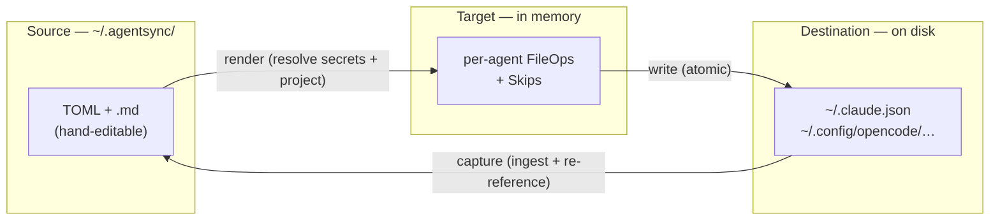
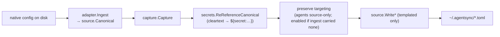

# 架构

agentsync 是如何组合在一起的：数据模型、应用/捕获管道、
漂移分类器，以及使其值得信赖的安全性和秘密不变量
足以指出您的真实配置和真实凭据。

如果您还没有阅读过，请先阅读[概念和术语表](concepts.md) — 此页面
假设该词汇。有关逐个包的索引，请参阅
[组件图](components.md)。

---

## 1. 三态模型

agentsync继承了chezmoi的三态设计。每一次操作都是一次比较
**源**（您提交的内容），**目标**（源呈现的内容，
在内存中计算）和**目的地**（每个代理中磁盘上的内容）。





漂移是与记录在中的 **最后应用的** 哈希值进行哈希比较
状态：如果目标的哈希值不再与 agentsync 最后写入的内容匹配，则
文件是在 agentsync 外部编辑的。

---

## 2. 规范模型*是*模式

没有单独的内部 IR。 `internal/source` 中解析的 Go 结构体
`~/.agentsync/` 中的 TOML/markdown 是规范模型
(`source.Canonical`)，适配器直接从它渲染。添加组件
field 意味着改变这些结构；添加代理意味着添加适配器
消耗它们——模式是两者之间的契约。


```
source.Canonical
├── Config          (agentsync.toml: agents, update defaults, secrets backend, [memory] banner)
├── MCPServers      (mcp/*.toml)
├── Skills          (skills/<name>/ — SKILL.md + bundled scripts/references/assets)
├── Subagents, Commands, Hooks, LSPServers
├── Plugins, Marketplaces   (plugins/*.toml, marketplaces/*.toml)
├── Memory          (memory/AGENTS.md + fragments/; rendered files get the managed banner — see below)
└── Project         (overlay loaded from a <root>/.agentsync/ tree, project scope)
```


在**项目范围**，从存储库中第二次加载相同的规范
`<root>/.agentsync/` 树（相同的布局）并覆盖到用户规范上
by `project.Merge`：条目按 id/name（项目获胜）、项目内存合并
已附加，并且排除带有 `disabled = true` 的项目 `plugins/<id>.toml`
来自该回购协议中的预测。该项目的`[agents]`表**权威**
— `project.Merge` 永远不会继承用户启用的代理，因此完全相同
提交的源为每个协作者呈现相同的效果。空或不存在
项目 `[agents]` 在渲染之前被 `requireProjectAgents` 拒绝
(`internal/cli`)，每个作用域感知命令通过
`loadProjectedForScope`（`check` 在其自己的加载路径上调用它）；错误
指向 `agentsync agent add <name> --scope project`。 `import --scope project`
故意豁免：它是用于引导树的捕获路径。已退役的 M5 单文件 `.agentsync.toml` 标记不再
读取 — `project.Discover` 如果发现迁移错误，则会显示迁移错误。

**托管内存横幅。** 每个渲染的内存文件（`CLAUDE.md`、`AGENTS.md`、
...) 前面带有一个简短的 agentsync 通知，命名文件并指向编辑
返回 `.agentsync/memory/AGENTS.md` + `agentsync apply`。每个适配器都会渲染
通过一个助手`source.RenderManagedMemory`（它包装了
`ExpandMemoryImports`），因此横幅在代理之间是字节相同的。它是一个
*仅渲染的目标文件的属性 - 它被包装在可逆的
`<!-- agentsync:managed memory-banner -->` 标记（`agentsync:managed`
命名空间带有每个标记标识符，以便将来的托管标记保留
明确）并被 `source.StripManagedBanner` 剥离
返回途中（每个适配器的摄取，加上 `import` /
`reconcile` 回写漏斗），因此它永远不会进入规范源，也永远不会
化合物。因为横幅文本是静态的（只有文件名不同），所以它会进行哈希处理
在每个渲染上都相同，因此未受影响的文件仍然分类为 `InSync` —
横幅从不制造漂移。默认情况下它是打开的； `[memory] banner = false`
`agentsync.toml` 中选择退出（项目叠加层继承用户设置，除非
它自己设置）。 `agentsync:managed` 标记是**保留**：`checkReservedMarkers`
（在 `loadMemory` 和 `WriteMemory` 中）拒绝其主体或片段的规范
携带它而不是让它与横幅的标记碰撞，并且
`StripManagedBanner` 匹配 agentsync 的完整渲染横幅（不是裸露的横幅）
标记），因此它仅删除 agentsync 自己的横幅 - 用户创作的标记块
被保留，从未被删除。

---

## 3. 适配器合约

每个代理集成都实现一个接口 (`internal/adapter/adapter.go`)：


```go
type Adapter interface {
    Name() string
    Detect() (bool, error)          // is this agent installed? (informational; consumed by `doctor`)
    Render(r secrets.Resolved, scope Scope, project string) ([]FileOp, []Skip, error)
    Ingest(scope Scope, project string) (source.Canonical, error)
    KeyMergeStrategy() string       // "merge-json-keys" | "merge-jsonc-keys" | "merge-toml-keys" | ""
    Apply(ops []FileOp, w DestWriter) error
}
```


两个值得内化的设计要点：

- **`Render` 仅接受 `secrets.Resolved`，从不接受原始 `source.Canonical`。**
  `Resolved` 是通过秘密替换产生的包装类型；你不能通过
  模板化的源模型到 `Render`，并且您无法传递已解析的
  （明文）模型给源作者。这使得“泄露一个已解决的秘密”
  进入源代码”是*编译错误*，而不是代码审查检查。
- **每个目标写入都会经过 `DestWriter`。** 适配器从不调用
  `iox.AtomicWrite` 或破坏性的 `os.*` 系列
  (`os.Remove`/`os.RemoveAll`/`os.WriteFile`/`os.Create`) 直接。 `DestWriter`
  拥有外部冲突备份不变式（备份任何预先存在的文件
  在覆盖之前，agentsync 尚未拥有）。一条 `forbidigo` lint 规则 — 加上一条
  腰带和支架源扫描测试 (`internal/render/writer_lint_test.go`) —
  在允许的非目标包之外进行任何直接写入都会失败，因此新的
  适配器无法取消备份保证。
- **项目范围需要项目根目录。** 每个适配器的 `ResolvePaths` 都会下降
  当项目根目录为空时，到 *user* 范围路径，因此
  `(ScopeProject, "")` 调用会默默地将项目覆盖写入
  用户的全局配置。每个范围解析适配器方法 -
  `Render`、`Ingest` 和 `IngestPlugins` — 调用 `adapter.RequireProjectRoot`
  第一件事并返回 `ErrProjectRootRequired` - 一个巨大的失败
  最窄的腰部而不是无声的错误范围 I/O。 CLI 的
  `resolveScope` 已经保证了项目范围的非空根，所以这
  是针对未来或非 CLI 调用者的深度防御。
- **摄取仅将 `os.IsNotExist` 视为“缺少组件”。** 本机配置
  用户从未创建的文件（或组件目录）是静默跳过；任何
  *其他*在*当前*文件上读取或解析错误 — 权限错误、
  `EISDIR`、瞬态 I/O 或损坏的 `settings.json`/`config.toml` — 是
  返回，因此瞬态故障永远不会读取为漂移的空组件
  可能会被错误分类为“用户清除了它”，然后协调可以写回
  与规范来源无关。共享的 `adapter.ReadFileOptional` /
  `adapter.ReadDirOptional` 帮助器统一强制执行缺席与错误的分割
  跨每个适配器的 `Ingest` （组件目录内的每个条目读取
  循环仍然是故意跳过的，在存在警告接收器的地方作为警告出现）。

**组件支持由 `Render` 发出的内容表示，而不是功能
声明。** 当代理没有组件的本机目标时，其 `Render`
返回该组件的 `[]Skip` 条目，而不是 `FileOp` — 没有
单独的功能位掩码以与渲染逻辑保持同步。所以
OpenCode 适配器将 Hook 和 LSP 报告为跳过；克劳德、法典、光标和
其他 v1 适配器也将 LSP 报告为跳过（Claude Code 从
插件清单而不是 `settings.json`，并且 agentsync 不会合成
v1 中的 Claude 插件；其他没有本地 LSP 配置概念）。

**跳过是键入的，而不是字符串分类的。** `Skip` 带有 `Kind`
(`adapter.SkipKind`): `SkipDropped` 当整个组件没有本机目标时
并且在渲染时未发出，`SkipReduced` 但丢失了代理拥有的字段
没有家（子代理的克劳德专用 `tools`/`color`，命令的 frontmatter）。
构建 `Skip` 的适配器设置 `Kind` — CLI 的 `plugin explain` 读取它
直接将其显示为 `kind` (`"reduced"`/`"dropped"`)。
零值 `SkipKindUnset` 无效：`Component` 是普通类型 (`mcp`,
`subagent`，...）并且不再通过 `-frontmatter` 后缀对区别进行编码。
两个互补的防护装置使得非机密料斗无法运输。
`TestEverySkipLiteralSetsKind` (`internal/adapter`) 静态解析每个
`internal/` 下的产生式 `adapter.Skip` 文字，如果省略 `Kind` 则失败
— 与可达性无关，因此跳过站点位于一条永远不空的路径上
运行时（例如范围间隙分支）无法隐藏它。 `TestEveryAdapterClassifiesSkips`
(`internal/cli`) 是行为补充：它渲染每个注册的
适配器在两个范围内，在任何未设置的 `Kind` 上失败，并固定这两个类型值
被锻炼。

**键合并策略和磁盘格式。** `KeyMergeStrategy` /
`FileOp.MergeStrategy` 命名适配器如何在共享配置中共同拥有密钥
文件：`merge-json-keys`（Claude 的 `.claude.json`/`settings.json`，项目的
repo-root `.mcp.json` 用于项目范围的 MCP 服务器，Cursor 的 `.cursor/mcp.json` +
`.cursor/hooks.json`、Windsurf 的 `~/.codeium/windsurf/mcp_config.json`、Roo 的项目 `.roo/mcp.json`、
和克莱恩的 `~/.cline/mcp.json`），
`merge-jsonc-keys`（OpenCode 的注释容忍 `opencode.json` 和 Gemini 的
`.gemini/settings.json` — 共同拥有 `mcpServers` 和 `hooks`），以及
`merge-toml-keys`（法典的`config.toml`）。继续适配器共同拥有无共享
文件（它为每个项目投影一个块文件），因此它没有键合并策略。

每个适配器都有**恰好一个**键合并策略。 `orphanCleanupOps`
(`internal/render/pipeline.go`) 综合来自
单个静态 `KeyMergeStrategy()` 值并将其应用于*每个*键合并
适配器拥有的目标，因此适配器在以下文件中共同拥有密钥
*当前不支持*不同的*磁盘格式** - 它需要
首先将访问器扩展到每路径策略。中央警卫
(`TestKeyMergeStrategy_MatchesEmittedOps`, `internal/cli`) 渲染真实的
MCP+挂钩固定装置通过每个已注册的适配器和引脚 `KeyMergeStrategy()`
反对它发出的每个键合并 `FileOp` 上标记的 `MergeStrategy`，因此
访问器永远不会默默地偏离适配器实际写入的内容。

Error 500 (Server Error)!!1500.That’s an error.There was an error. Please try again later.That’s all we know.

Error 500 (Server Error)!!1500.That’s an error.There was an error. Please try again later.That’s all we know.

Error 500 (Server Error)!!1500.That’s an error.There was an error. Please try again later.That’s all we know.

- **Claude** 在 `import` 上读取 `enabledPlugins` / `extraKnownMarketplaces` 并
  故意让 `apply` 上的两个键保持不变。国外参赛作品
  （用户直接在克劳德代码中启用的插件，用户的市场
  手动添加）由合并键编写器保留，因为渲染
  不主张这些钥匙。
- **Codex** 在 `~/.codex/config.toml` 下记录启用状态
  `[plugins."<name>@<source>"]` 表格 — 相同的 `name@source` 形状 Claude
  用途。 `IngestPlugins` 将这些 TOML 表解析为 `NativePlugin` 记录。
  与 Claude 不同，Codex 在记录的文件中没有记录市场“获取来源”
  配置位置，因此它不返回 `NativeMarketplace`； `import` 解决
  每个插件的市场来自agentsync自己的注册市场
  （警告+跳过任何它不能的），正是克劳德的路径
  自动可用的内置市场。 Codex 渲染从不发出
  `[plugins."x@y"]` 表返回，符合 Claude 规则。
- **OpenCode**、**Gemini CLI**、**Continue**、**Windsurf**、**Roo Code** 和
  **Cline** 没有本机插件概念 agentsync 模型（Gemini 使用
  扩展； continue 组成 Hub + local 块），所以它们都没有实现
  侧面 — 所有仍然*接收*插件投射的组件（技能、MCP，...）
  `apply` 与其他所有组件一样，因为这就是重点。
- **Cursor** 附带一个真正的适配器（MCP、内存、技能、子代理、命令、
  hooks），但尚未实现 `PluginIngester`。它的插件 *content* 架构 —
  `.cursor-plugin/plugin.json` + `.cursor-plugin/marketplace.json`，几乎相同
  到 Claude 的 `.claude-plugin/*`（规则、技能、代理、命令、钩子、MCP）—
  表示投影层大量传输，但 Cursor 记录本地
  *enable-state* 没有记录（可能是应用程序本地的，就像它的用户规则一样），所以
  `import` 上的插件发现被推迟。当该位置被识别时
  游标适配器为其实现 `PluginIngester` — 并且，通过相同的不变量，
  仍然永远不会将其渲染回来。它已经*接收*插件投影的组件
  像所有其他适配器一样在 `apply` 上。

请参阅源链接的功能矩阵。

### 插件组件命名空间

`LoadProjected` 将每个启用的插件的组件扁平化为一个规范
模型，适配器从组件的 `Name` 派生每个目标路径。所以
两个插件传送同名组件在一个路径上渲染两个文件 - a
真实的库存案例：`feature-dev` 和 `pr-review-toolkit`（均为 Claude 官方
插件）每艘船 `agents/code-reviewer.md`。申请被正确拒绝，因为
默默保留一个就是数据丢失。但这两个文件都位于
市场管理的插件缓存，因此修复名为“重命名一个”的错误 -
是用户在结构上无法执行的一项（问题#211）。

**因此，插件提供的子代理、技能或命令被重命名为
`<plugin>-<name>` 在投影**处，在 `marketplace.namespaceProjected` 中，其中
还标记 `Plugin` （提供插件的 id）和 `BaseName` （上游
名称）到组件上。值得了解的三个后果：

- **从结构上来说，这不是适配器问题。** 当出现以下情况时，出处就会被丢弃
  `loadProjected` 将每个插件的组件附加到平面切片中，因此通过
  当适配器可以*检测到*冲突时，*解决*所需的信息
  它消失了。重写 `Name` （而不是教每个适配器“有效的
  name") 也是在不更改适配器的情况下保持每个渲染站点正确的原因。
- **如果存在的话，frontmatter `name` 键将在步骤中重写。** 重命名
  无论如何，只有文件会让组件发生碰撞：Codex 的 `name` *is*
  代理的身份和 Codex 适配器更喜欢它而不是文件主干，并且
  克劳德的特工技能需要 frontmatter `name` 来匹配技能
  目录。缺席的 `name` 会一直缺席，因此永远不会发明一个身份
  上游工件未声明。
- **手工创作的组件永远不会重命名。** `Plugin`/`BaseName` 为空
  对于他们来说。请注意，这与“插件永远无法获取您的名字”不同：
  派生名称不是单射的，因此插件可以使用您选择的名称。那
  残差被 `checkProjectedConflicts`（如下）捕获并报告，从不
  默默地以插件有利的方式解决了。

分隔符是连字符，因为 Claude Code 将子代理 `name` 记录为
“使用小写字母和连字符的唯一标识符”——它很熟悉
`plugin:agent` 表单是*范围标识符* Claude Code 源自插件
目录，从来没有 `name` 值，并且 `:` 被拒绝
`source.ValidateComponentID`（它成为文件名，冒号在
窗户）。插件 ID 来自市场，不受 agentsync 的信任
边界，因此每个派生名称都会通过相同的写入边界重新验证
在到达路径或诊断之前进行消毒。

MCP 和 LSP 服务器故意**不**重命名。它们是 id 密钥的并且
已被 `checkProjectedConflicts` 覆盖，其在相同 id 上出现硬故障
分歧是一种安全属性：声称一个服务器 ID 的两个来源可以是
无声端点劫持，这是一种拒绝而不是重新命名的情况。
它们带有来源标记，因此捕获路径仍然可以拒绝它们。
Hooks 根本没有名称键。

**派生名称不是单射的，因此碰撞防护保持不变。**插件 `a`
运输 `b-c` 和插件 `a-b` 运输 `c` 均派生 `a-b-c`，并且用户
手工作者 `feature-dev-code-reviewer` 与什么插件 `feature-dev` 发生冲突
得出。 `checkProjectedConflicts` 因此准确地保护名称键控组件
因为它保护 MCP/LSP id——对于变异负载来说是致命的，对宽大的警告
只读的 - 其消息命名每一方的起源（提供插件，
或用户自己的规范文件）。如果没有它，这些情况就会到达渲染
管道，其中不同的内容中止，并显示一条无法命名的消息
来源（`FileOp` 没有出处）和**相同的内容默默地
重复数据删除**，删除根本没有报告的组件。无声的滴落是
警卫存在的原因；它只是使之变得可行的响亮的声音。

命名空间本身永远不会失败。早期版本验证了派生名称
投影并返回错误——回归，因为投影本身
`validateProjectedName` 允许 `:` 和控制符文，并且因为 `loadProjected`
无论 `lenient` 如何，都会传播投影错误，删除只读
命令的整体设计是降级并显示状态。安全生命这个名字
在单个调度腰部的下游，`render.Plan` 在此运行
`ValidateComponentID` 在每个组件 id 被加入到一个之前
目的地路径。

重命名发生一次，在升级后第一次应用时，因此 `apply` 回收
之前写入的预重命名目标文件 - 请参阅
[§7 安全原语](#7-safety-primitives)。没有它，陈旧的
`~/.claude/agents/code-reviewer.md` 将位于两个命名空间文件旁边，并且
克劳德·代码会加载它，给用户留下“更多”的重复代理
之前。

### WarnEmitter（可选）

第二个可选扩展允许调用者重定向适配器的警告
`Ingest` 发出（宽松的 YAML 通知、删除的组件……）
`os.Stderr`：


```go
type WarnEmitter interface {
    SetStderr(w io.Writer)
}
```


具体适配器（claude/opencode/codex）实现它； noop 适配器
不会（它不会发出警告）。每个实施者的四个合同规则
荣誉：

1. **`SetStderr(nil)` 重置为默认值** (`os.Stderr`) — 并且必须
   不要惊慌。由每个适配器固定 `TestSetStderr_NilResetsToDefault`
   通过管道捕获 `os.Stderr` 并断言警告的测试
   实际上降落在那里——一个错误的 `SetStderr(nil)` 路由到
   `io.Discard` 不会通过。
2. **在 Ingest 之前配置 stderr。** 适配器对 writer 进行快照
   摄取条目 (`warn := a.stderr()`)，因此在摄取过程中调用 `SetStderr`
   该调用的其余部分将被忽略。摄取前的 `RouteTo`
   模式是支持的模式；不依赖于动态切换。
3. **针对 `adapter.WarnEmitter` 编译引脚。** 每个适配器的
   `claude_test.go` / `opencode_test.go` / `codex_test.go` 带有一个
   `var _ adapter.WarnEmitter = a` 行因此删除方法失败
   测试构建，而不是运行时无操作。
4. **作者的一生是来电者的问题。** 今天的来电者
   (`import`) 使用恢复句柄模式 —
   `defer warnW.RouteTo(a)()` 立即评估内部 `RouteTo(a)`
   （连接写入器）并推迟返回的恢复关闭（调用
   `SetStderr(nil)` 在出去的路上） — 与 `defer warnW.Flush()` 配对
   排空 WarnWriter 的行汇编缓冲区中的任何部分行。

`import` 是今天唯一的调用者：它将 `cmd.ErrOrStderr()` 包装在
`ui.WarnWriter` 将 `"warning: "` 行前缀重新设置为粗体黄色
`"⚠️ warning:"`，然后 `defer warnW.RouteTo(a)()` 注入包装器
并安排恢复。相同的包装器支持 `capture.Opts.Warn`
以及命令自己的 `io.warn` 调用，因此用户看到的每个警告
在导入期间（适配器、捕获或 CLI）共享一种样式。

出于与 `PluginIngester` 相同的原因，远离核心 `Adapter`：
不发出摄取警告的适配器不应被强制实施
setter 它永远不会使用。

### VersionedDirs（可选）

第三个**可选**扩展允许适配器声明磁盘上的目录
apply tail 应该保留在本地的 git 回滚历史记录中（问题 #118，步骤 9
如下）：


```go
type VersionedDirs interface {
    VersionRoots(scope Scope, project string) []string
}
```


它是**只读**并且不会扩大 `Render`/`Apply` 合约 - 它只是
报告要备份的目录。每个实施者都遵守的合同：

Error 500 (Server Error)!!1500.That’s an error.There was an error. Please try again later.That’s all we know.

Error 500 (Server Error)!!1500.That’s an error.There was an error. Please try again later.That’s all we know.

`--dry-run` 运行步骤 1-6，然后运行步骤 7 的非写入过程（写入者的合并
+ 收敛检查，无磁盘写入），以便它可以标记每个目的地 `✓ synced`
vs `→ write` 并预览外部碰撞备份，并打印计划/报告 —
所有这些都无需写入一个字节（并且它完全跳过了 git-backup 步骤 9）。

---

## 5. 捕获管道（目标 ▶ 源）

反向路径 — 由 `agentsync import` 和协调的 `[w]rite-back` 使用 —
只执行一个函数 `capture.Capture`：





`capture.Capture` 是单个目标→源渠道。它**重新引用**任何
在写入之前将秘密解析回其 `${secret:…}` 形式，并且它保留
以目的地为目标的服务器未完全携带： MCP/LSP 服务器的
`agents` 列表仅包含源（没有本机目标携带它）并且始终会恢复，
while `enabled` — 某些目的地*确实*携带（Codex 读取本机
`enabled` 返回，问题 #152) — 仅当摄取携带时才从源恢复
无，因此真正的本机启用/禁用往返而不是重置。它还
**规范化数字传递值**：适配器摄取解码本机 JSON/JSONC
与 `UseNumber` 和 MCP/LSP `Extra` 地图中留下的 `json.Number` 将为
由 go-toml 编组为 TOML *string* (`timeout = '30'`)，默默地翻转
下一次渲染时值的本机类型 - 因此 Capture 会转换每个 `json.Number`
写入之前到 `int64`/`float64`。没有其他
代码路径将目标数据写回到源中。 （两个受保护的代码路径
*删除*规范文件而不通过捕获：`reconcile`的
当用户写回a时，`removeDroppedSource`取消链接`mcp/<id>.toml`
目标端服务器删除 — 按键门控，`withinDir`-限制为
`~/.agentsync` - 以及导入的陈旧钩子退休调用 `source.RemoveHooks`
在 `hooks/<event>.toml` 上。纯粹的删除不包含可重新引用的内容，因此
漏斗的秘密保证不起作用；任何写*内容*的东西
返回仍然必须经过`capture.Capture`。）

**插件提供的组件永远不会被捕获。**从
安装的插件没有自己的规范文件——它是从
每次加载时都会进行插件缓存 - 因此为其中一个写回一个目的地将*铸造*一个
其（命名空间）名称下的规范文件。下一个负载将容纳两个
该名称的组件、捕获的副本和插件自己的投影，
渲染到一个目标路径，该路径适用拒绝。两个目标→源条目
点拒绝：

- **`import`** 跳过插件提供的组件，并带有警告命名
  插件，如果用户明确指定一个插件，则会直接出错。一个适配器的
  `Ingest` 读取代理的本机配置，其中呈现文件 agentsync
  插件与手写的插件没有什么区别——所以导入项目
  单独插件（`pluginProvided`）并按组件名称匹配，即
  现在插件组件已经命名了。如果该预测失败
  过滤器失败**关闭**（导入拒绝）而不是继续
  空跳过集：过滤器的存在是为了阻止导入中毒规范
  源，并且它由插件数据提供，因此故障打开将是一种切换方式
  防守关闭。
- **`reconcile` 的 `[w]rite-back`** 拒绝该物品并指向 `[o]verride`。
  它来自 PROJECTED 规范，因此出处已经在
  组件（`pluginProvidedSourceIDs`）并且不需要重新投影。的
  检查位于调度腰部 `writeBackItem`，因此它覆盖了这两个形状：
  由 SourceID 和关键级 MCP/LSP 服务器匹配的整个文件组件
  从项目的 JSON 指针进行匹配。

这涵盖了 **MCP 服务器、LSP 服务器和挂钩** - 插件拥有但不是
命名空间。捕获 MCP/LSP 服务器会生成可呈现的规范副本
今天相同，但在插件更新时有所不同，此时
`checkProjectedConflicts` 拒绝每次加载。 `MCPServer.Plugin` /
`LSPServer.Plugin` / `Hook.Plugin` 携带该出处（派生状态，从不
已序列化，每个都在 `walkerCovered` 中分类为非秘密。

**钩子是按 HANDLER 过滤的，而不是按事件过滤的。** 规范
`hooks/<event>.toml` 拥有来自多个来源的多个处理程序，因此拒绝整个
事件，因为插件贡献了一个会默默地删除用户自己的。的
join key 是内容签名（事件+匹配器+类型+命令），这就是
让导入将插件的预计处理程序与代理的本机摄取相匹配 -
摄入根本没有来源。协调解决没有所有者的钩子问题
构造：仅针对 MCP 服务器实现密钥级写回，并且
对于所有其他指针形状已经错误，因此没有注册钩子键
它找到了。查找仍然显式返回“”而不是失败，
因此稍后实现钩子写回不能默默地允许捕获。

关键项查找从操作的 SourceID 中获取组件 KIND，而不是从
指针的根键。根键是每个代理数据（`generic.MCPTarget.RootKey`
随着每个代理的添加而增长：`/context_servers`、`/servers`、`/amp.mcpServers`），
因此，手动维护的许可名单会默默地放弃对每个人的拒绝
忘记了。相反，针对这两种类型探测 id 会比不精确更糟糕：
发布名为 `github` 的 LSP 服务器的插件将生成 `/mcpServers/github`
指针解析到它，拒绝用户自己的 MCP 服务器的写回，并且
归咎于不拥有它的插件。 Continue 是一个将 MCP 呈现为
**整个文件** op（每个服务器一个文件），因此服务器在两个
裸 `mcp/<id>` 键和 `mcp/<id>.toml` SourceID 表单。

两个查找的范围都限于渲染实际使用的规范：在项目中
范围是仅项目覆盖，因此用户范围插件永远不会隐藏
仅共享其名称的项目组件。

**一个例外，它是故意不对称的。** 用户也可以使用的组件
声明不被视为插件提供 - 但仅适用于 **hooks**，因为
`source.WriteHooks` 替换整个 `hooks/<event>.toml`，因此处理程序导入
拒绝捕获已从规范来源中“删除”。其他地方
(`WriteMCP`, `WriteSkill`, …) 为每个组件写入一个文件，因此拒绝会删除
什么都没有——让用户的主张获胜会更糟：导入会
捕获漂移的原生内容、用户的副本和插件的投影
会发散，并且每个后来的变异负载都会发生硬故障
`checkProjectedConflicts`。覆盖的存在是为了防止删除，而不是为了
决定所有权。

该编辑属于插件的上游，或者可以禁用该插件。这是
捕获侧补充
[插件组件命名空间](#plugin-component-namespacing)。

重新引用按值匹配，因此无法区分*移动或旋转*
来自故意的非秘密编辑的秘密。作为**故障关闭逆止器**，
`capture.Capture` 重新扫描即将写入的模型
(`secrets.ResidualSecretCleartext`)：如果实时保管库秘密值仍然是
逐字写入，或 `${secret:K}` 引用的来源已从
捕获的组（轮换/编辑掉），它**拒绝写入**而不是冒险
持久明文 - 指导用户更新保管库或编辑源。
无论长度如何，后备都会检测实时秘密值：它**不**
继承基于重新引用值的后备长度下限（跳过 1-3
char 值以避免子字符串重写不相关的文本），因为拒绝
持续泄漏并不是重写——所以即使是 1-3 个字符的凭证也会导致泄漏。

逆止器也是**在不确定性下自动关闭**：其价值得以构建
通过解析源的 `${secret:…}` 引用来设置其检测
后端。如果后端无法解析它们（保管库锁定/不可用），则设置
是空的，并且插脚是“盲目的”——它不能证明已解决的秘密没有被移动
进入文字字段。因此，源引用中存在无法解析的 `${secret:…}`
强制 `capture.Capture` **拒绝**整个写回而不是失败
直至警告；用户解锁/恢复保管库（或编辑规范
直接来源）并重试。 (`${env:…}` 不受影响 — 值尖头解析
仅通过秘密后端，因此无法解析的环境引用将保持警告。）

---

## 6. Drift — 三向分类器

`internal/drift` 是三个哈希值的纯函数。对于每个托管文件或
关键：

- `H_src` — 现在从规范源计算
- `H_applied` — 在 `targets.json` 中记录最后应用
- `H_dest` — 当前磁盘内容（或零）

| `H_applied` 与 `H_src` | `H_applied` 与 `H_dest` |班级 | `apply` 行为 |
|---|---|---|---|
| = | = | **干净** |努普 |
| ≠ | = | **待定** |写`H_src` |
| = | ≠ | **漂移** |覆盖 `H_dest` — 没有备份，因为该文件已经是国有的（`reconcile` 是您保留编辑的方式） |
| ≠ | ≠，`H_dest = H_src` | **收敛** |静默刷新状态 |
| ≠ | ≠，全部不同 | **冲突** |覆盖 `H_dest` — 没有备份，同样的原因（`reconcile` 是合并编辑的方式）|
| `H_applied` 零，`H_dest` 零 | — | **新** |创建 |
| `H_applied` 零，`H_dest` ≠ 零 | — | **外来碰撞** |备份dest，然后写入|
| `H_src` 零，`H_applied` ≠ 零 | `H_dest = H_applied` | **孤儿** |删除 |
| `H_src` 零，`H_applied` ≠ 零 | `H_dest ≠ H_applied` | **孤儿漂流** |备份dest，然后删除|

`apply` 永远不会阻止或提示其中任何一个 — 它始终会完成运行。
只有 `foreign-collision` 和 `orphan-drifted` 在执行之前获得每个文件的备份
写入/删除（见下文）：这是目的地保存的两种情况
内容 agentsync 尚未拥有状态。 `drift` 和 `conflict` 是
根据定义已经属于国有，因此编写者的每个文件备份路径
(`Writer.maybeBackupFileOp`) 跳过它们并直接覆盖 — 手
编辑完全丢失； `reconcile` 是您首先捕获它的方式，并且是用户范围
apply 的目标 git-versioning （上面第 4 节，默认 `prompt`，选择退出）是
启用后的事后恢复网 — **项目中完全不存在
范围**，因此项目范围漂移/冲突覆盖不会自动
恢复完全超出您自己对目的地的源控制。

相同的状态所有权检查管理密钥合并操作（`Writer.maybeBackupKeyOp`）
每个 JSON 指针，而不是每个文件 - 您拥有的漂移/冲突的密钥是
没有备份就被覆盖，就像整个文件漂移/冲突一样。两个
那里存在更窄的例外：拥有的顶级部分（`mcpServers`，
`hooks`, …) 持有外部标量/数组而不是对象 - 这可以
只意味着那里写了其他东西，因为agentsync从不存储任何东西
但是一个拥有密钥的对象——无条件备份整个文件，
无需咨询所有权；以及任何一个无主、不同的指针
另一个拥有的文件中的其他位置会触发整个文件备份，作为
副作用，还会保留您拥有的、漂移的密钥。

`drift.SafeForAutoApply(class)` 是 `reconcile --auto-safe` 所咨询的 — 它
仅自动解决不会丢失工作的情况（`converged`、`pending`）。

** `apply` 上的孤儿回收。** `apply` 本身回收了两种孤儿，因此
已删除的组件不会停留在目标中：清空的键合并部分
（一个 MCP/hook/LSP 部分，其源为空——通过合成的清理
空合并操作）和 **整个文件组件**，其 `source_id` 位于
`skills/`、`subagents/`、`commands/` 或已退休的 `agents/` 拼写 — 一个整体
技能，其中一个捆绑 `scripts/`/`references/`/`assets/` 文件，一个
子代理，或源不再呈现的斜线命令。退休者
列出前缀是因为规范 `agents/` → `subagents/` 重命名在
与命名空间相同的版本：升级用户的状态仍然保留旧的
拼写，唯一的重写器从 `migrate subagents` 运行，对于
其子代理仅来自插件的用户。没有它他们的预重命名
目的地永远不会被回收——正是需要删除的剩余部分。在每种情况下，作者都会删除
孤立文件并**首先备份 `orphan-drifted` 目标**（手动编辑是
从未在未保存的情况下被破坏）。如果预删除读取由于任何其他原因失败
比“已经消失”——`EACCES`、`EIO`、`EISDIR` 或不规则形状（如
读取会阻塞而不是失败的 FIFO — 一个删除被 **跳过**
带有警告而不是盲目执行：agentsync 无法判断是否
目的地保存了未同步的编辑，并且聚合永远不值得丢失数据。的
运行本身会继续，因为在失败时，挥之不去的孤儿不会丢失数据
apply 会楔入所有其他代理的写入。 **重试跳过的删除**：
`PruneStaleState` 保留可回收目标的状态条目，即
仍在磁盘上，因此下一次应用会再次尝试并再次发出警告，而不是
永远忘记该文件。空目录修剪适用于**技能
only** — 技能是代理技能规范下的一个目录，因此必须删除
回收整棵树，修剪至但不包括特工的技能根；
子代理和命令是代理始终拥有的目录中的平面文件。

子代理和命令在这里加入了技能，因为[插件组件
命名空间](#plugin-component-namespacing) 重命名每个插件提供的
组件仅一次，升级后首次应用。无需开垦
预重命名文件会持续存在，并且 Claude Code 会读取其中的*每个*文件
Agents 目录 — 它的文档明确指出两个相同的 `name` 定义合二为一
目录意味着它只加载一个，“由文件系统读取顺序选择，而不是
记录优先级”。相同的收敛论证涵盖了普通的去除
来自规范源，该源之前一直徘徊到 `reconcile`。

**粒度。** 按 **JSON 跟踪结构化文件 (JSON/JSONC/TOML)
指针**，因此agentsync可以在`~/.claude.json`内拥有`$.mcpServers.github`
没有触摸按键就不会写字。那些未触及的键是**外键**
— 出现在 `status` 中，但从未进入分类器。如果是结构化文件
解析失败，算法在整个文件上降级到文件级别。

---

## 7. 安全原语

全部出现在 v1.0 中（`internal/iox`、`internal/render`、`internal/state`）：

1. **两阶段原子写入** — 写入 `.state/staging/`、fsync、重命名到
   最终的路径。崩溃会留下旧文件或新文件，而不会留下部分文件。
2. **文件锁** — `.state/apply.lock` 上的 `gofrs/flock` 序列化并发
   `apply`/`reconcile`。 `apply --dry-run` 是只读的并且不加锁。
3. **`AGENTSYNC_TARGET_ROOT`** — 每个目标路径都通过一个助手解析
   (`internal/paths`)，因此测试将 `$HOME` 重定向到 tmpdir。 `forbidigo` 规则
   禁止 `_test.go` 中的 `os.UserHomeDir()`。
4. **首先应用备份** — `foreign-collision` 案例复制预先存在的备份
   写入之前将目的地写入 `.state/backups/<ts>/`。符号链接
   默认情况下拒绝目的地。
5. **Manifest-SHA 固定** — 每个插件都会记录一个 `tree:v1:` 内容哈希
   在它的*整个*缓存树上（每个预计的组件体——技能，
   命令/子代理降价 - 不仅仅是 `plugin.json`，不包括 `.git/`），所以
   重新上传的版本*或*被篡改的组件主体被检测为漂移
   而不是默默地消耗。 （没有缓存主体的仅限入门插件是
   固定在其市场入口上。）
6. **显示边界清理，由类型强制执行** (`internal/untrusted`) —
   获取的/本机插件或市场 ID、版本或名称可以携带终端
   转义（屏幕清晰/重新着色 CSI、OSC 标题集）或欺骗性的 bidi /
   零宽度符文（“特洛伊木马来源”）。这些字段是定义的字符串类型
   `untrusted.Text`，其 `String()` 运行 `Sanitize`，因此打印 1 到
   `fmt` 通过构造**消除危险；原始值只能达到
   通过显式的 `Unverified()` （文件系统/查找使用，从不显示）。的
   线路格式不变（`Text` 是字符串类型 — `omitempty` 和 `--json`
   保留原始输出）。这还涵盖 **native-ingested** 插件
   name: `PluginIngester` 的 `adapter.NativePlugin.Name` 是 `untrusted.Text`，所以
   `status`/`doctor`“未声明的本机插件”注释打印它清理
   通过构造（通过 `untrusted.Join`），没有每个站点 `ui.Sanitize` 包装器。
   基于反射的 `TestUntrustedFieldGuard`
   (`internal/{source,marketplace,render,adapter}`) 如果新字符串则构建失败
   这些结构上的字段未分类，因此未来的元数据字段不能
   作为原始字符串发送，新的打印站点会泄漏。剥离（十六进制 SHA，`%q`
   URL、用户提供的 CLI 参数、枚举模式和仅限 `import` 的诊断
   Surface — 本地市场 ID/源类型）保持纯字符串。参见
   `SECURITY.md`。
7. **渲染时组件 ID 防护** (`render.Plan`) — 每个深度适配器都加入一个
   组件 id 转换为目标文件名：文本组件的规范 `Name`
   (`filepath.Join(dir, Name+ext)`)，并且，对于每个写入一个文件的适配器
   服务器，MCP/LSP 服务器 ID（续
   `filepath.Join(MCPDir, id+".yaml")`）。像 `../../../tmp/x` 这样的 id 会渲染
   `FileOp.Path` 转义代理的配置目录——一个随处写入的原语
   申请时；市场预测的 MCP ID 是一个特别不受信任的来源（
   原始清单映射键，没有自己的遍历检查）。调度腰
   立即关闭 **所有** 适配器的此设置：id 集是模型范围的，因此 `Plan`
   **预先验证** - 每个子代理/命令/技能 `Name` **和**
   每个 MCP / LSP 服务器 ID（包括项目覆盖） — 具有 **相同**
   `source.ValidateComponentID` 目标 → 源写入边界使用 (§5)，因此
   源→目标和目标→源边界共享一个消毒剂——分隔符，`..`，
   绝对路径、裸露 `.`、全空白或控制/欺骗性符文被拒绝
   两个方向相同。遍历轴承 id 是一个硬错误：
   **整个计划被拒绝**（绝不是 `adapter.Skip`，这意味着良性的
   能力差距），带有与代理无关的消息，该消息命名组件类型和
   id — id 是模型范围内的，不是某个代理的错误。保守派 `filepath.Clean`
   遏制逆止器
   另外拒绝任何已清理路径仍向上遍历的已发出写入
   — 深度防御，还涵盖捆绑的技能文件路径
   (`Skill.Files[*].Path`)，合法包含 `/`，因此不是单一的
   id。 `Plan` 只读取 id **strings** （通过仅字符串
   `secrets.Resolved.ComponentIDs()` 访问器），从不解开已解析的模型
   到可写的 `source.Canonical`，这样守卫就不会越过秘密 lint
   栅栏（§8）。

---

## 8. 秘密——如何防止泄漏

危险的错误类别是一个*已解析的明文秘密，该秘密被保留回来
进入规范源*（通常是提交的点文件存储库）。代理同步使
通过三层防御很难偶然做到这一点：

- **强制编译（承载）。** `secrets.SubstituteCanonical` 返回
  `secrets.Resolved`，一个不能分配给 `source.Canonical` 的包装器。
  适配器的 `Render` 采用 `Resolved`；源作者和`capture.Capture`采取
  仅模板化的 `source.Canonical`。将解析后的数据传递给编写器是
  编译错误。
- **值不变（承载）。** 秘密替换克隆模型
  在解析之前（没有别名回到调用者的模板化副本），并且
  田野漫步者只访问带有秘密的字段——因此文本组件（内存、
  技能包括他们捆绑的文件、命令）在物理上不能携带
  替代的秘密。
- **棉绒栅栏（纵深防御）。** `forbidigo` 规则禁止展开
  `Resolved` 位于两个适配器 `Render` 出口站点之外。
- **捕获失败关闭的后挡板（纵深防御）。** *目的地→来源*
  方向不能是类型强制的（它合法地编写了一个模板化的
  `source.Canonical`），并且重新引用按值匹配 - 所以一个秘密*移动*
  进入文字对应字段或*旋转*到vault-unknown值可以
  逃避恢复。 `capture.Capture`重新扫描即将写入的模型
  (`secrets.ResidualSecretCleartext`) 和 **如果已解决则拒绝写入**
  秘密会持续存在，而不是猜测。

有一个**可接受的残留**：*故意*两步洗钱（击败
lint fence 以获得可写的 `source.Canonical`，然后调用源编写器
直接）可能会泄漏。没有任何无辜的错误会产生它，并且 `capture.Capture`
总是重新引用。单个字段列表位于 `walkSecretFields`
(`internal/secrets/walk.go`);如果新的，基于反射的测试失败
添加字符串型秘密承载字段，不进行分类。

MCP/LSP `Extra` 直通映射（未建模的本机字段，逐字携带）
是一个 **故意的例外**：它们不在 `walkSecretFields` 中，所以
`Extra` 中的 `${secret:…}` 按字面意思编写，而不是解析。泄漏
backstop 单独扫描 `Extra` (`scanExtraResidual`) 并拒绝写入
将通过它保留一个实时的秘密值。

** `__` 前缀是代理同步保留的 `Extra` 命名空间。** `__` 前缀
`Extra` 键是 agentsync-INTERNAL 往返元数据，绝不是逐字本机
字段 — 当前唯一使用的是 continuedev 的 `__block_version` / `__block_schema`，
通过Continue MCP块的`version`/`schema`标头往返
共享 `Extra` 地图。因为 `Extra` 是一个 **共享** 规范字段，所以此命名空间
往返双方对称地由 agentsync 拥有：共享
`claude.MergeExtra`（渲染）永远不会将 `__` 键投影到目标中，并且
`claude.ExtraNativeKeys`（捕获）从不摄取 - 所以一个适配器是合成的
密钥永远不会泄漏到另一个代理的本机配置中，以及杂散的本机 `__`
密钥永远不会被捕获然后默默地丢弃。拥有保留的适配器
键直接读取和写入它们（continuedev 的 `blockHeader` /
`applyBlockHeader` 在块级别操作，绕过两个共享助手）。否
支持的线束使用 `__` 前缀的本机配置键。

> 如果您发现自己在适配器之外解开 `secrets.Resolved`
> `Render`，停下来——你几乎肯定想要 `capture.Capture`。全套
> 不变量位于 [`CLAUDE.md`](../CLAUDE.md) 和 [`SECURITY.md`](../SECURITY.md) 中。

---

## 9. 网络边界

每一条网络路径都存在于 `internal/marketplace` 的获取器中，并且每一条
其中仅写入 `.state/cache/`。到达网络的命令是
`plugin outdated`、`plugin upgrade`、`plugin add`、`marketplace add`、
`import <agent>:plugin` 和 `init <git-url>`。
他们克隆或获取市场（`go-git`，带有 `git` shell-out
稀疏克隆的回退）和 npm tarball（注册表 HTTP，无 `npm` 二进制文件
必填）。其他所有内容 - 包括 `apply` - 仅从该缓存读取，
这使得 `apply` 在 CI 中保持快速、离线和可重现。

此边界处的不受信任输入强化：获取器拒绝 tarball 中的符号链接
（并将 git 克隆的符号链接限制到获取的树上，拒绝任何逃逸的符号链接），
符号链接-解析本地市场条目之前的源路径
市场根包含检查（因此既不是符号链接路径也不是符号链接
中间目录可以将副本指向根目录之外 - 请参阅
`RelativeFetcher`），限制解压大小（`AGENTSYNC_MAX_TARBALL_MB`），验证
清单 SHA，将组件路径绑定到插件缓存，并拒绝
`http://`/`git://` 来源，除非 `AGENTSYNC_ALLOW_INSECURE_URLS=1`。

---

## 10. 首次运行升级通知

如果用户不知道的话，破坏性的重命名只是半途而废，并且
agentsync 在其通过的任何渠道上**没有可用的安装后挂钩**：
`go install` 根本没有，Homebrew *cask* 的 `caveats` 仅在
安装时，Scoop什么都没有，只有deb/rpm有真正的脚本。所以一个
基于钩子的消息只会到达少数人，而默默地错过其他所有人。的
二进制文件是唯一可靠地到达升级用户的东西，这使得
这是用户必须执行的任何操作的单一渠道 - 以及一个横幅
失火比没有更糟糕。

**它运行的位置。** `maybePrintUpgradeNotice` 连接到 root 命令的
`PersistentPreRunE` (`internal/cli/upgrade_notice.go`)，所以每个子命令
继承它。 Cobra 的钩子是一个普通的域，因此它与
`enforceScopeStance` （最后运行并拥有返回的错误，因为它是
可以“拒绝”命令的一半）而不是接受第二次分配：
第二个 `cmd.PersistentPreRunE =` 默默地丢弃第一个 - 它确实如此
范围执行一次，CI 始终呈绿色。
`TestRootDeclaresExactlyOnePersistentPreRun` 第二次构建失败
分配，并且因为 cobra 只运行链中*最近的*钩子，
`TestNoSubcommandOverridesPersistentPreRun` 将相同的危险防护一级
下来。

**记录。** `.state/last-run.json` (`internal/state/lastrun.go`)，一个
**故意将文件与 `targets.json`** 分开：

- 只读 `status` 必须能够记录它显示了通知，并且
  `targets.json` 仅由 *mutating* 命令写入 - 每天的用户
  循环永远不会应用，否则将永远看到横幅；
- UX 标记没有业务门控或碰撞漂移状态
  `SchemaVersion`。

`.state/` 被 gitignored，因此记录永远不会与 dotfiles 存储库一起传输。

**通过 ID 键入，从不通过版本比较。** 每个通知都带有一个稳定的 `ID`
记录在`NoticesSeen []string`中；显示/跳过决定是一个纯字符串
成员资格测试（`rec.Seen(n.ID)`）。这就是让用户能够跳跃多次的原因
发布版本会看到他们错过的每个通知，并停止预发布或非 semver
默默地建造一个。因此，该表是 **仅追加：从不重命名，
重新编号，或删除条目。** 重命名会向所有访问者重新显示通知
已经驳回了；重复的使得第二个无法访问；删除
孤儿其他警卫读到的退休。 `Since` 和通知正文是
可以随时自由更改——只有 ID 在发布后才会被冻结。

**不变量，每个测试固定：**

1. **stderr，始终** — `status --json` / `diff --json` / `explain --json` 管道
   它们在标准输出上的有效负载，并且那里的横幅会破坏调用者解析的内容。
2. **永远不要全新安装。**对于没有任何问题的用户来说，没有任何东西会被破坏。
   配置。触发器是常规的 `agentsync.toml`，而不是主目录：
   项目范围用户的家是由中央政府创建的，而不是由`init`创建的。
   当家不在时写下记录也“具体化”了它，所以
   用户的第一个 `agentsync init` 会拒绝并显示“已包含文件” —
   因此 `init` 为记录本身播种 (`seedUpgradeNoticeRecord`)，并且
   今天设置的机器后来再也不会被告知早于它的重命名。
3. **对于无版本 (`dev`) 构建保持沉默**，这使其远离本地
   `go build` 和整个测试/BDD/e2e 套件。
4. **对于 shell 完成保持沉默。** Cobra 为其运行根预运行钩子
   也隐藏了 `__complete` 请求，并且完成脚本丢弃 stderr — 所以
   否则，一个 TAB 会将横幅打印到 `/dev/null` 中并记录它所看到的。
5. **自始至终尽力而为，并且不需要锁定。** 每次读/写失败
   降级为“什么都不说”或“稍后再显示”；它永远不会让用户失败
   命令。损坏或被截断的记录读作“此处未显示任何内容” —
   打印，然后修复——因为不可解析的记录不包含任何内容
   信息，并将其视为致命的，永久抑制该消息
   用户需要的。
6. **选择退出不会记录。** `AGENTSYNC_NO_UPGRADE_NOTICE=1` 抑制
   没有看到标记，因此稍后取消设置仍然会出现看不见的通知。

**一个值得了解的结果。** 无锁使得通知路径成为
只能在工具中进行读-修改-写操作，并且它可以与自身同时运行
执行两次写入，并具有*不同的*答案。

`ensureStateGitignore` 是 `O_APPEND` — `iox.AtomicWrite` 并不安全
（固定的兄弟临时名称意味着并发写入者共享一个 inode）并且它
另外拒绝符号链接的目的地，这会默默地离开
chezmoi/Stow `.state/` 的用户未被忽略。结构防护固定附加
并禁止在那里编写整个文件。

`state.SaveLastRun` *确实*经过`iox.AtomicWrite`，因此*可以*
同一种族下的撕裂。这是故意的不对称，而不是豁免：
撕裂 `.gitignore` 破坏了用户编写的规则并且无法恢复，而撕裂
`last-run.json` 是一个 UX 标记，`LoadLastRun` 报告为
`ErrCorruptLastRun` — 读作“这台机器没有显示任何内容”，打印出来，并且
被覆盖。它可以自我修复，但代价是一个重复的横幅，这正是
为什么上面的不变量 5 将损坏的记录视为宽恕而不是致命的。
该记录可以安全地撕毁*因为*没有任何东西依赖于它；一个成功的领域
权威需要一个唯一的临时名称或全局锁。

**横幅的内容也被固定**，而不仅仅是其管道：每个退休的人
命令必须在其替换之前命名，并由认可的中断连接
短语，带有无别名断言并且没有连续性声明。所共享的
`retirements` 表是该检查的预言机，对于复活守卫，
对于陈旧的散文扫描 - 因此退休不能添加到一个和
被遗忘在别人身上。

---

## 11. 输出——一个诊断词汇

agentsync 打印的所有内容都是两件事之一，并且 `internal/ui` 是唯一的
决定两者外观的地方。

| |它是什么 |流 |渲染|
| ---| ---| ---| ---|
| **诊断** | *关于*这次跑步的通知 |标准错误| `✗ ERROR` / `⚠ WARN` / `ℹ INFO` / `• DEBUG`;第 9 栏消息 |
| **结果** |要求命令生成什么 |标准输出|无等级标签；精心策划的表情符号带来成功的结果 |

**为什么这是一个架构问题而不是样式问题。** Issue #211 报告了
纠正被视为损坏工具的故意致命错误，以及格式
原因是： `agentsync: render codex: …` 打印为左齐平、未着色和
未标记，直接位于来自不同的 `2026/07/28 15:03:45 WARN …` 行下方
子系统。致命事件与警告没有什么区别。原因是
三个不相关的效果图并存——

1.命令手动添加自己的前缀（`p.Yellow("agentsync:")`，
   `p.Cyan("note:")`、`p.Yellow("warning:")`、裸 `•`)；
2. 名为 `slog.Warn` 的库包，并且**未安装任何处理程序**，因此
   这些都属于 stdlib 默认值并打印有挂钟
   没有其他使用的形状中的时间戳；
3. `main` 打印终端错误本身，完全绕过 `ui`。

现在三者都汇合了。 `ui.Level` 拥有该标签； `ui.SlogHandler` 渲染 slog
通过它进行记录，并且 `internal/log` 将其安装为进程默认值
根`PersistentPreRunE`； `cli.Execute` 返回进程退出代码并打印
终端错误作为 `ERROR` 诊断 — 拥有整个
调用是让它读取仍在范围内的已解析的 `--color` 标志
root 命令而不是在包状态下跨越 `main` 边界。来自 `internal/marketplace` 的 `slog.Warn`，适配器的
`warning: ` 行到 `ui.WarnWriter`，以及命令的 `p.Warnf` 产生
字节相同的输出——用于清理干净的单行消息，这就是
真正的诊断是。这三个路径在恶意输入上故意有所不同：
`SlogHandler` 和 `WarnWriter` 进行清理，因为它们的输入是由
不能的包，而 `Diagf` 不能，因为它的调用者可能会传递它
预先设置样式的文本。 `TestWarnPathsAreByteIdentical` 固定干净的外壳。

**三大承重规则。**

- *字形和级别词是内容，而不是装饰。*颜色是第二位
  仅信号。通过管道、重定向、在 `NO_COLOR` 或 `--color never` 下，严重性
  仍然到达日志文件——这是 CI 读取它的地方。
- *颜色是按流解析的，而不是按打印机解析的。* `auto` 询问是否
  目的地是一个终端，stdout 和 stderr 是不同的目的地：
  来自终端的 `agentsync apply 2>err.log` 有一个 TTY 标准输出和一个文件标准错误。
  一项从 `Out` 中删除并重新用于 `Err` 的决定将 ANSI 写入该文件 —
  该规则所禁止的确切泄漏 — 并且由于每个诊断都会进入 `Err`，
  这是常见的路径，而不是特殊情况。 `ui.Printer` 因此持有两个
  决策，以及采用明确的 `io.Writer` 风格的作者
  他们实际瞄准的流。不被认可的作家的两个后备是
  故意相反：诊断采取 `Err` 决定，成功行
  需要`Out`。
- *命令的机器可读标准输出永远不会被诊断污染。* 这
  是重要的保证，也是端到端的保证
  (`TestSlogWarningNeverEntersAJSONPayload` 驱动一个真正的 `status --json`
  库 `slog.Warn` 正在运行，解析有效负载，并拒绝任何级别词
  在其中）。 `Errorf`/`Warnf`/`Infof` 全部写入 stderr，所以这成立
  每个命令的构建。

Error 500 (Server Error)!!1500.That’s an error.There was an error. Please try again later.That’s all we know.

`internal/ui` 被绘制为它自己的节点，而不是折叠到 `INFRA` 中，因为
区别在于承重，而不是装饰： **`internal/adapter` 和
`internal/capture` 不得依赖于 `ui`**，并且 `AD --> INFRA` 边进入
包含 `ui` 的节点完全断言了 §11 所禁止的依赖关系。那个约束
这就是为什么适配器将普通的 `warning: ` 哨兵发送到 `io.Writer` 中
交给而不是格式化标签本身。 `internal/render` *确实*取决于
`ui`（其翻译报告通过 `*Printer` 呈现）和 `internal/log`
也取决于它——所以 `log` 不再是叶子。

`internal/drift`、`internal/git`、`internal/iox`、`internal/jsonkeys`、
`internal/paths` 和 `internal/untrusted` 没有内部
依赖项 — 它们是叶子（`internal/git` 仅从 `cli` 到达 —
`internal/cli/gitbackup.go`、`doctor.go` 和 `revert.go`）； `internal/ui` 构建
仅在 `internal/untrusted` 上，`internal/log` 仅在 `internal/ui` 上。
请参阅[组件图](components.md) 了解每个包包含的内容。

**记录的分层异常（`opencode → state`）。**适配器否则取决于
仅在 `source`、`secrets` 和 infra 叶上。 OpenCode 适配器就是其中之一
例外：它的 `Ingest` 读取应用状态文件 (`internal/state`) 来构建
*所有权过滤器*因此它仅重新捕获agentsync实际写入的代理/命令，
从未在 OpenCode 的共享 `agents/`/`commands/` 目录中手工编写同级（问题
＃148）。这是一个故意的、开放代码范围的依赖关系——一般修复（线程
从 CLI 调用者设置的拥有路径，因此没有适配器接触 `state`) 是
类范围内的后续行动，因为还没有其他适配器过滤摄取所有权。国家
**关键格式** 过滤器重建不会默默地重复：往返
通过真实的 `render.RecordOpsState` 测试种子所有权，因此任何漂移
关键方案打破了这一测试，而不是默默地捕捉不足。

## 13. 项目治理预检

`internal/governance` 保持技术中立的基线、项目配置文件、
以及与任何一项业务分开的显式代理能力注册表
存储库。 `governance` CLI 组将该模型公开为预编辑
预检：`scan` 是只读的，`init` 只写入项目本地治理
源，`check` 验证所选合约，并且 `capabilities` 报告
不支持或部分投影，而不是假装所有代理线束
是等价的。

基线拥有通用的决策边界。配置文件自己的特定项目
堆栈、命令、文档根和本地适配器选择。生成
本地代理文件是预测，而不是策略源；缺席的合规者
实现、新的依赖项、新的状态或样式系统，或者有损
适配器需要显式停止而不是发明的回退。

## 14.桌面客户端和本地Core sidecar

macOS 第一个桌面客户端位于 `desktop/` 下，并使用 Tauri 2 和
React/TypeScript 用户界面。它的 Rust 命令不解析 TOML、Agent 文件或
秘密。他们启动 `agent-assistant-core` Go sidecar 并交换一个 JSON
通过标准输入/标准输出的每个命令的请求/响应。边车复用
`source.Load`、共享生产适配器注册表、`render`、`drift` 和
`state`；桌面是现有 agentsync 合约的创作界面，
不是第二个配置引擎。

本地库存是证据，而不是政策。它的出处被标记为 `agent`
UI 并且永远不会自动写回。 sidecar 返回 MCP 名称，
传输、经过编辑的端点主机和秘密引用/配置状态；它
从不读取 auth/vault 文件或返回环境值。实模式是
Tauri 应用程序的默认设置。演示数据仅在显式的情况下可用
`VITE_CORE_MODE=demo` 设置，并且缺少的 sidecar 显示为错误
而不是默默地用演示数据替换。

第一个桌面切片发现下面一层的项目树
`$HOME/git/work`（或`AGENT_ASSISTANT_PROJECTS_ROOT`）并报告“已发现”，直到
应用状态/漂移投影已连接。因此，它并不声称
观察到的本机文件已被渲染或同步。

### 规则编写和同步

全局规则源是`~/.agentsync/memory/`；项目规则源是
`<project>/.agentsync/memory/`。仅内存模型通过相同的方式呈现
CLI 应用适配器，然后过滤到 `SourceID == memory/AGENTS.md`。核心
将所需的、最后应用的和目标哈希值与九种情况的漂移进行比较
分类器。 `clean`、`pending`、`new` 和 `converged` 是安全的；原生漂移，
冲突、删除的拥有文件或外部冲突会停止整个规则
同步并返回纯文本差异。

普通同步请求没有强制模式。显式的 `backup-overwrite`
决议首先复制每个国有漂移/冲突目的地
`render.BackupFile`；外部冲突由 `render.Writer` 本身支持。
只有这样，正常适配器 `Apply` 路径才会运行并更新 `targets.json`。
仅规则同步故意记录其规则操作而不进行修剪
其他组件状态。

手动项目导入
`~/.agentsync/.state/agent-assistant/projects.json`。导入验证和记录
路径，然后要求适配器提供无害的探测，只是为了获取它们的
已验证的项目规则目标路径。它不会初始化 `.agentsync/`
项目内部。相同的原生体产生确定性的提议；
仅在明确的用户操作下，才可以将不同的主体发送到已安装的
只读临时会话中的 Codex CLI，忽略了项目规则并且
严格的 JSON 输出架构。 AI输出只是一个建议，从不写源代码
或目的地。